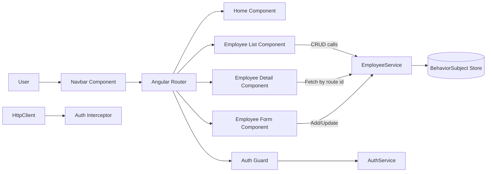

# Employee Management Dashboard (Angular + TypeScript)

A full-featured Employee Management Dashboard built with Angular architecture fundamentals: components, routing, services, guards, reactive/template-driven forms, directives, pipes, RxJS, and Angular Material UI.

## Features

- Employee list with Angular Material table (`MatTable`) and CRUD actions.
- Employee detail page loaded with route parameters.
- Add/Edit employee using reactive form validation.
- Template-driven department filtering using `ngModel`.
- Route guard based authentication simulation.
- HTTP interceptor that injects mock auth headers.
- Custom pipe: department filter.
- Custom directive: highlight high-salary employees.
- Built-in pipes: currency and date formatting.
- Lifecycle hooks (`OnInit`, `OnDestroy`) for data flow and cleanup.

## Project Structure

```text
src/
 ├─ app/
 │   ├─ components/
 │   │   ├─ navbar/
 │   │   ├─ home/
 │   │   ├─ employee-list/
 │   │   ├─ employee-detail/
 │   │   ├─ employee-form/
 │   │   └─ login/
 │   ├─ directives/
 │   ├─ guards/
 │   ├─ interceptors/
 │   ├─ models/
 │   ├─ pipes/
 │   └─ services/
 │
 ├─ main.ts
 └─ styles.css
```

## Architecture Diagram



## Setup Instructions

1. Install dependencies:

   ```bash
   npm install
   ```

2. Run development server:

   ```bash
   npm start
   ```

3. Open the app:

   ```text
   http://localhost:4200
   ```

## Data Model

`Employee`

- `id: number`
- `name: string`
- `email: string`
- `role: string`
- `department: string`
- `salary: number`
- `joiningDate: string`

## Notes

- This project currently uses an in-memory observable store for CRUD simulation.
- You can swap `EmployeeService` implementation with a JSON Server/REST API backed by Angular `HttpClient`.
